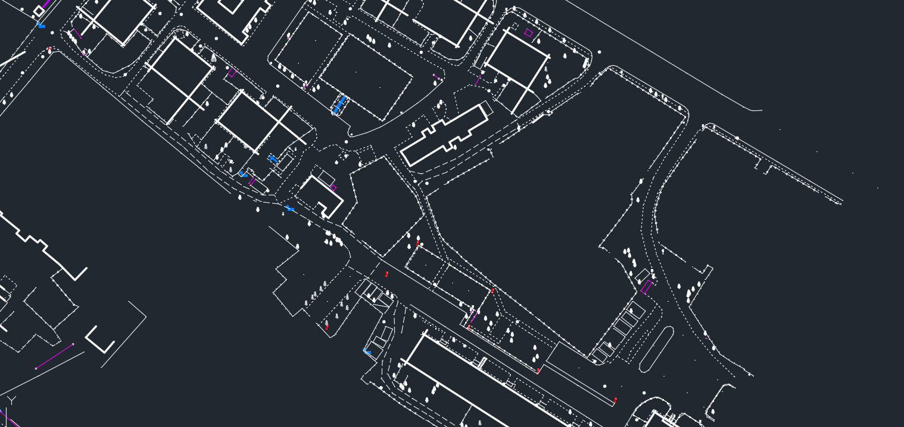

# ABRIS

Программный комплекс для автоматической отрисовки топографических
планов по кодам пикетов. 

ПК представляет собой две реализации программы:

- **ABRIS BOT** доступный в мессенджере Telegram
- Десктопная версия программы **ABRIS EDRAWER** (на данный момент находится в разработке)

## Содержание
1. [Быстрый старт с **ABRIS BOT**](docs/quick_start_bot.md)
2. [Система кодирования](docs/coding.md)
3. [Классификатор системы кодирования](files/classifier.pdf)