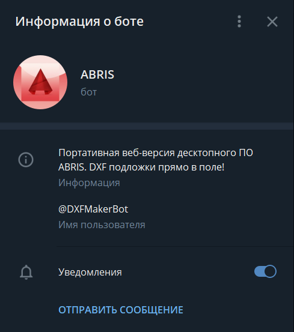
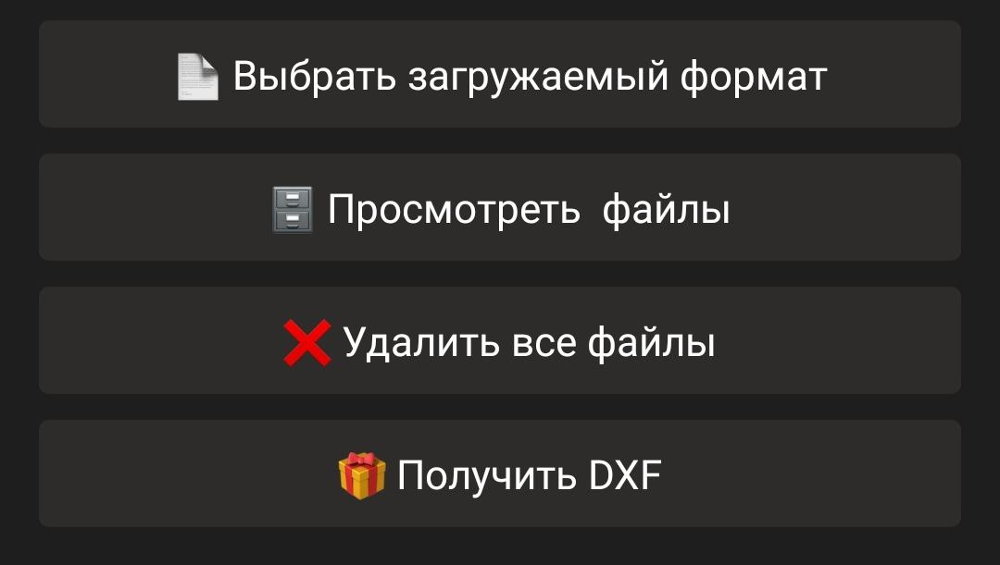

## Быстрое начало работы с **ABRIS BOT**

Версия ПО **ABRIS BOT** - упрощенный вариант десктопного приложения **ABRIS EDRAWER**.
Бот автоматически отрисовывает **DXF** подложки в заданном шаблоне по сырым данным геодезических измерений.

Ссылка на **Telegram ABRIS BOT**: https://t.me/DXFMakerBot

### Описание
Основным преимуществом данной версии является ее портативность. Бот может работать как в десктопной версии Telegram,
так и на мобильном телефоне, контроллере GNSS оборудования, так и в браузере.

Бот позволяет работать нескольким людям одновременно в одной рабочей папке, что дает возможность загружать сырые данные
с разных контроллеров GNSS оборудования для получения общей **DXF** подложки прямо в полевых условиях.

### Команды

Основные команды для взаимодействия с ботом:
1. */registration* - Регистрация пользователя как сотрудника компании (работа в одной общей папке) или как независимого 
пользователя (свое собственное пространство для работы)
2. */test* - Получение сырых файлов для тестирования работы бота
3. */delete_me* - Удаление пользователя из базы данных бота с удалением всех файлов

### Регистрация

При регистрации как сотрудник компании, Вы попадете в общую папку для всех пользователей,
относящихся к данной компании. Каждый сотрудник компании может загружать файлы в общую папку и получать единую DXF подложку
(например, несколько бригад, работающих на одном объекте).

Для регистрации компании свяжитесь со мной по [почте](andrey.pochatkov@ya.ru) или в [telegram](https://t.me/andrpocc).

Если Вы регистрируетесь как самостоятельный пользователь, Вы автоматически попадете в свою личную папку для работы. Файлы Вами загруженные доступны только Вам.

### Клавиатура

Главная клавиатура для управления ботом загружается после регистрации пользователя:

1. *Выбрать загружаемый формат* - Выбор формата загружаемых данных. На данный момент доступно два формата для загрузки:
*"Geodimeter GNSS"* и *"№-N-E-H-C"*. При необходимости может быть добавлен новый формат (свяжитесь с разработчиком).
2. *Просмотреть файлы* - Отправляет список файлов, находящихся в папке на данный момент.
3. *Удалить все файлы* - Очищает рабочую папку.
4. *Получить DXF* - Отрисовывает DXF подложку из всех файлов, загруженных в рабочую папку.

### Форматы файлов
Формат *"Geodimeter GNSS"* является уникальным форматом, добавленным по запросу компании. Формат представляет собой **TXT**
файлы. Пример файла можно получить по команде - */test*. 

| Номер пикета | Код пикета | Высота вехи | Север | Восток | Высота |
|:---:|:---:|:---:|:---:|:---:|:---:|
| 1 |  74..  | 2.000 | 439152.949 | 2203042.631 | 122.969 |

Формат *"№-N-E-H-C"* является простым форматом с разделителем. Разделитель в файле определяется автоматически. При загрузке
файл должен иметь расширение **TXT**.
Пример файла:

| Номер пикета | Север | Восток | Высота | Код пикета |
|:---:|:---:|:---:|:---:|:---:|
| 1 | 439152.949 | 2203042.631 | 122.969 | 74.. |

### Префиксы к номерам пикетов

Префиксы к пикетам автоматически расставляются по первой букве в названии файла сырых измерений.
Как пример, при имени файла *"g567_gps.txt"* для каждого пикета в данном файле при отрисовке будет
добавлен префик - *"g_"*.

Для того чтобы префиксы к пикетам не добавлялись, имя файла должно начинаться с цифры *"0"*. Как пример,
имя файла *"0567_gps.txt"*.

### Отрисовка подложки

Подложка отрисовывается в формате **DXF** и отправляется ботом сообщением.

Перед отрисовкой можно запустить анализатор высот, работающий в **тестовом режиме**.

Анализатор высот построен так, чтобы находить ошибки в высоте пикетов, такие как:
1. Ошибка высоты вехи
2. Ложные фиксированные решения

